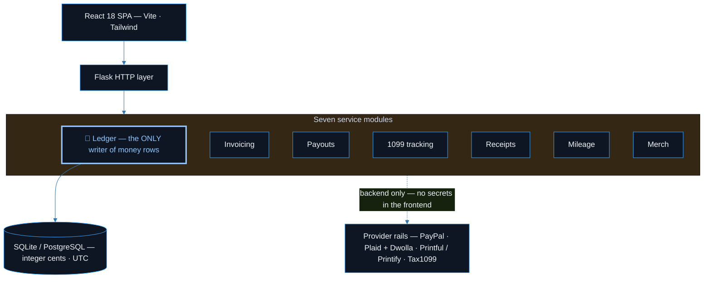
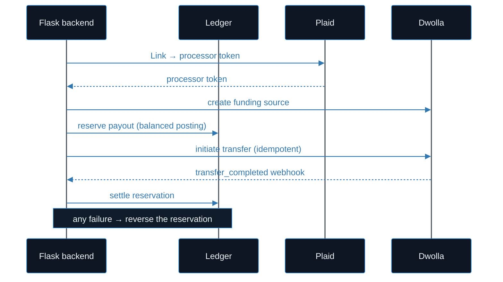

<div align="center">

# 🏦 Acme Finance Suite

**A self-owned, double-entry finance backend for a small services business — invoicing, contractor payouts, receipts, mileage, merch COGS, and 1099 tracking — with payment providers used only as rails.**

[](./LICENSE)
[](#stack)
[](#stack)
[](#stack)
[](#status)

**[Features](#features)** · **[Tech Stack](#stack)** · **[Getting Started](#start)** · **[Architecture](#architecture)** · **[Design Rules](#rules)** · **[Status](#status)**

</div>

---

This is a QuickBooks-style finance system built the other way around: **the ledger is the system of record**, and PayPal / Plaid / Dwolla are treated as swappable rails rather than the center of the money system. The core design constraint is that the business never becomes a money transmitter — every dollar moves on a licensed provider's rails, and no raw bank numbers are ever stored.

> [!TIP]
> It runs **fully local** with SQLite and **no provider credentials** — each integration drops into a `dry_run` mode that records the same ledger state without making an outbound call, so you can exercise the whole invoice → payout → tax flow offline.

<a name="features"></a>

## ✨ Features

- **Append-only double-entry ledger** — the only writer of money rows. Every posting validates `Σdebit == Σcredit` or raises; a DB trigger rejects unbalanced entries on commit. No `UPDATE`/`DELETE` on ledger tables.
- **Customer invoicing** — PayPal Invoicing client (OAuth2 token caching, create/send/cancel/refund), with webhook reconciliation and a polling fallback so an invoice only flips to `paid` via a verified event.
- **Two-phase contractor payouts** — Plaid Link → processor-token → Dwolla funding source, with an idempotent transfer that reserves in the ledger, calls Dwolla, and only settles on the `transfer_completed` webhook. Failures reverse the reservation.
- **1099 tracking** — YTD-per-contractor totals read straight from the ledger, threshold tables seeded per tax year, and a double-reporting guard keyed on the payment rail.
- **Receipt inbox** — multipart upload → draft → confirmed → reconciled, posting a ledger expense entry on confirm.
- **Mileage logs** — IRS rate table snapshotted onto each row at insert, so re-rating a year never rewrites past trips.
- **Merch fulfillment** — provider-agnostic routing (Printful / Printify / local) that posts both revenue and COGS on a sale.
- **HMAC server-to-server bridge** — optional signed relay to an external CRM Worker (SHA-256 over `ts.nonce.body`, ±60s replay window), with an optional operator-JWT layer on top.

<a name="stack"></a>

## 🧰 Tech Stack

| Layer | Choice |
| :--- | :--- |
| **Backend** | Python 3, Flask 3, SQLAlchemy |
| **Database** | SQLite (local) / PostgreSQL (production) |
| **Frontend** | React 18, Vite, Tailwind CSS, React Router |
| **Auth** | HMAC-SHA256 (server-to-server) + optional JWT (operator) |
| **Encryption** | Fernet at-rest for provider tokens |
| **Tests** | pytest (unit) + Playwright (E2E smoke) |
| **Providers** | PayPal (inbound), Plaid + Dwolla (payouts), Printful/Printify (merch), Tax1099/Track1099 (e-file) |

<a name="start"></a>

## 🚀 Getting Started

Backend:

```bash
cd backend
python -m venv .venv
source .venv/bin/activate      # Windows: .\.venv\Scripts\Activate.ps1
pip install -r requirements.txt
python seed.py                 # creates SQLite db + chart of accounts + thresholds + rates + demo data
python app.py                  # serves on http://127.0.0.1:5055
```

Frontend (separate terminal):

```bash
cd frontend
npm install
npm run dev                    # serves on http://127.0.0.1:5180
```

No credentials are required to run locally — every provider stays in `dry_run` mode until you fill in `.env` (see [`.env.example`](./.env.example)). Run the backend test suite with `cd backend && pytest -q`.

<a name="architecture"></a>

## 🏗️ Architecture

Seven service modules sit behind a Flask HTTP layer; **only the Ledger service may write money rows**. Providers are reached exclusively from the backend — no frontend code ever touches a Plaid/Dwolla/PayPal secret or calls a provider directly. Money amounts are stored as integer cents, timestamps as UTC.



### 🔁 Two-phase contractor payout



<a name="rules"></a>

## ⚖️ Design Rules

> [!IMPORTANT]
> The design rules that shape the whole system:
>
> 1. **Not a money transmitter** — all movement rides PayPal/Dwolla rails.
> 2. **No raw bank numbers in the DB** — provider tokens + last-4 only.
> 3. **No auto-filing of income tax returns** — packets only.
> 4. **No customer ACH debit** without NACHA-compliant consent + account validation.

The full design spec lives in [`docs/source-knowledge-base/`](./docs/source-knowledge-base/) (13 documents), and the phased build plan is in [`BUILD-SPEC.md`](./BUILD-SPEC.md).

## 🌐 Live Demo

_Demo link: TBD_

## 📸 Screenshots

<a name="status"></a>

## 🚦 Status

Prototype / portfolio project.

- [x] Append-only double-entry ledger — implemented and unit-tested
- [x] Invoicing · payouts · 1099 · receipts · mileage · merch flows — implemented and unit-tested
- [ ] Bank-feed reconciliation — partially built

Provider integrations are written against the real APIs but exercised here in `dry_run` mode.

## 📄 License

MIT — see [LICENSE](./LICENSE).
